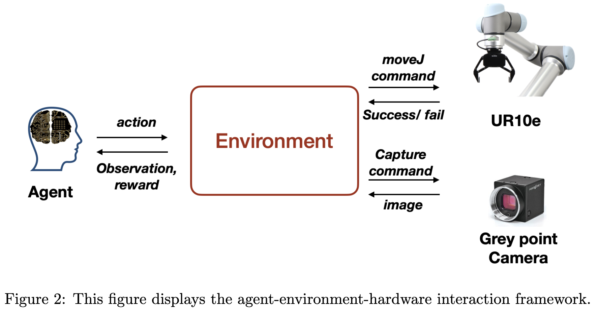
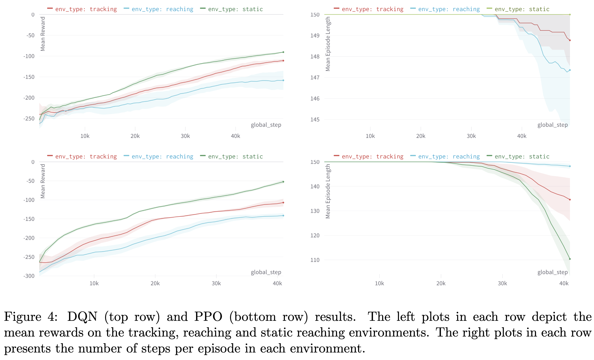

# bendRL: Visual Reaching and tracking

In this work, we evaluate the ability to learn image-based reaching and tracking tasks via reinforcement learning on the UR10e robotic arm by Universal Robots




## Objective

This work explores the potential of on- and off-policy reinforcement learning algorithms to perform image-based reaching and tracking tasks. In order to guage performance in a realistic manner, the physical training environment contains variable light conditions and numerous objects and colours that may distract the agent. All training is performed end-to-end and online. 

## Installation

### Dependencies
To control the robot and send it commands, you must install ur_rtde, for which the dependencies are Boost and Pybind. To install the dendencies on Ubuntu Linux run: 
```
sudo apt-get install libboost-all-dev
pip install pybind11
``` 
Next, following instructions available here: https://sdurobotics.gitlab.io/ur_rtde/installation/installation.html 

Optionally if you want to use ur_rtde with Python make sure pybind11 is checked out from the submodule before attempting to build using:

```
git submodule update --init --recursive
```

#### Build
```
git clone https://gitlab.com/sdurobotics/ur_rtde.git
cd ur_rtde
git submodule update --init --recursive
mkdir build
cd build
cmake ..
make
sudo make install
```

Then, you are ready to clone the following repository and start a training session by launching the script

>> 

### Installing and using URSim from Universal Robots

1) Download the right version of URSim (the one corresponding to your robot controller software or the most recent one) from Universal Robot’s Downloads section. Software > Offline Linux-based simulator > right version. Then, extract the file.
2) Then, you need to select JDK 8. Here is how:
```
sudo apt-get update 
sudo apt-get install openjdk-8-jdk -y
```
Select JDK 8 from the list of available versions by executing one of the following commands in a Linux terminal (the second one worked for me).
```
sudo update-alternatives --config javac
sudo update-alternatives --config java
```
Then you have to type the number corresponding to version 1.8
Verify the java version by executing the following command in Linux terminal.
```
java -version
```
3) Open the install.sh file, replace libcurl3 with libcurl4 because libcurl3 is obsolete for Ubuntu 20. 
4) In a terminal, navigate to the file where you extracted the URSim software and run the installation by clicking:
```
./install.sh
```

#### POSSIBLE ERRORS and fixes

1. If you get a java version error message, try replacing the following lines in the original install.sh files:

```
needToInstallJava() {
echo "Checking java version"
if command -v java; then
	# source https://stackoverflow.com/questions/7334754/correct-way-to-check-java-version-from-bash-script
version=$(java -version 2>&1 | awk -F '"' '/version/ {print $2}')
echo version "$version"
if [[ "$version" > "1.6" ]]; then
	 echo "java version accepted"
return 0
	fi
fi
return 1
}
```
with lines suggested here, as follows:

```
needToInstallJava() {
    echo "Checking java version"
    if command -v java; then
        # source https://stackoverflow.com/questions/7334754/correct-way-to-check-java-version-from-bash-script
        version=$(java -version 2>&1 | awk -F '"' '/version/ {print $2}')

        echo "Stripping the front end"
        majorVersion=${version%%.*}
        echo Java major version "$majorVersion"
        if [ "`echo "$majorVersion > 1.6" | bc`" -eq 1 ]; then
            echo "java version accepted"
            return 0
        fi
    fi
    return 1
}
```

2. On Ubuntu version higher than 20, the package lib32gcc1 has changed its name to lib32gcc-s1. This needs to be changed BOTH in
   a) the install.sh file, line 77 AND
   b) the control file, inside the libxmlrpc-c-ur_1.33.14_amd64.deb package (location is something like: URSim_Linux-3.15.8.106339/ursim-3.15.8.106339/ursim-dependencies). 

To complete step b), I followed the following instructions, which I have adapted the instructions from here to work with Ubuntu 22.04: https://stackoverflow.com/questions/73895565/e-package-lib32gcc1-has-no-installation-candidate 

b) 1. Revealing contents of libxmlrpc-c-ur_1.33.14_amd64.deb
Navigate to URSim_Linux-3.15.8.106339/ursim-3.15.8.106339/ursim-dependencies and extract the concerned .deb file using:

```
ar x libxmlrpc-c-ur_1.33.14_amd64.deb
```
You should be able to see the following list of files: control.tar.gz, data.tar.gz, debian-binary. Dependency data is contained inside control.tar.gz.

b) 2. Unpacking control.tar.gz
Let's create new directory and extract the control archive there:
```
mkdir extras-control
tar -C extras-control -zxf control.tar.gz
```

You should see the following list of files inside extras-control: control, md5sums, postinst, postrm, shlibs. Dependency info is inside the control file. Open it with your text editor of choice and change the line:
Depends: llib32gcc1 (>= 1:4.1.1)
to
Depends: lib32gcc-s1, … REMOVE THE VERSION PARENTHESIS COMPLETELY

b) 3. Packing it back up
Now that the dependency is changed, first pack up the unpacked .tar directory, and then move it to the outer directory (this command must be ran from inside the extras-control directory):
```
tar cfz control.tar.gz *
mv control.tar.gz ..
```
Then, in the outer directory (ursim-dependencies), using ar pack up the following files into a new .deb package with:
```
ar r new_package.deb debian-binary control.tar.gz data.tar.gz 
```
b) 4. Install your new package

Finally, install your new package:
```
sudo dpkg -i new_package.deb
```
If all the steps were done correctly this should be successful and take 2 seconds

b) 5. Clean up and rename files

Then, delete all the unnecessary directories, files (leave only the five .deb files)
Delete the old libxmlrpc-c-ur_1.33.14_amd64.deb, and rename new_package.deb with the exact same name (‘libxmlrpc-c-ur_1.33.14_amd64.deb’). There should only be 5 .deb files inside ursim-dependencies at the end of this process

Lastly, try running ./install.sh again! 

#### TO START THE URSIM SIMULATION

To run the simulation for a UR10, navigate to the URSim directory and type
```
./start-ursim.sh UR10
```
(if you don’t type UR10, it will start UR5, which is the default).

Then, to run the training with the simulated robot, you simply need to change the robot's IP address to the one corresponding to URSim, which is 127.0.0.1
In the environment scripts, the line to change is the following:
```
self.HOST = "127.0.0.1"  # the IP address 127.0.0.1 is for URSim, 192.168.0.110 for UR10E
```

## Reproducibility 


## Results

The plots below show the learning curves for the DQN and PPO agents. PPO learns to achieve a much higher mean reward than DQN in the first 40k time steps. After an additional 20k of training steps DQN approachs PPO on reacher and tracker but remains significantly worse on the static reacher task.


